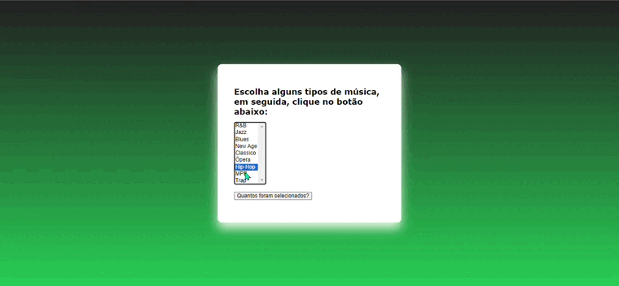

# **Laços e iterações**

## ``Home``

- [Funcionalidade](#funcionalidade)
- [Tipos-de-laço](#tipos-de-laços)
- [Conclusão](#conclusão)




# **Tecnologias utilizadas**
* GitHub
* VSCode

##  **Funcionalidade**

O código JavaScript incluído no exemplo demonstra o uso de um laço de iterações (loop) para percorrer as opções selecionadas no menu suspenso e contar quantas opções foram escolhidas pelo usuário. Esta funcionalidade é implementada da seguinte maneira:
```
function howMany(selectObject) {
  var numeroSelecionadas = 0;
  for (var i = 0; i < selectObject.options.length; i++) {
    if (selectObject.options[i].selected) {
      numeroSelecionadas++;
    }
  }
  return numeroSelecionadas;
}

var btn = document.getElementById("btn");
btn.addEventListener("click", function () {
  var selectForm = document.forms["selectForm"];
  alert("Total de opções selecionadas: " + howMany(selectForm.tipoMusica));
});
```

## **Nesse trecho de código:**
- A função howMany recebe o objeto do menu suspenso (selectObject) como argumento.

- Um laço for é usado para percorrer todas as opções dentro do menu suspenso (selectObject.options).

- Para cada opção, verifica-se se ela está selecionada (selectObject.options[i].selected).

- Se uma opção estiver selecionada, o contador numeroSelecionadas é incrementado.

- O total de opções selecionadas é retornado ao final da função.

## **Tipos de laços:**

- ### **Laço `for`**
O laço `for` é usado quando o número de iterações é conhecido antecipadamente.

Exemplo:
```
for (let i = 0; i < 5; i++) {
    console.log(i);
}
```

- ### **Laço `while`**
O laço `while` executa um bloco de código enquanto uma condição específica permanecer verdadeira.

Exemplo:
```count = 0
while count < 3:
    print("Contagem:", count)
    count += 1
```

- ### **Laço `do-while`**
O laço `do-while` é semelhante ao `while`, mas garante que o bloco de código seja executado pelo menos uma vez antes de verificar a condição.

Exemplo:
```
int i = 0;
do {
    cout << i << endl;
    i++;
} while (i < 3);
```

## **Conclusão**
Este README oferece uma explicação detalhada de um exemplo de página HTML interativa que utiliza JavaScript para contar o número de opções selecionadas em um menu suspenso. O uso de um laço de iterações (loop) é essencial para percorrer os elementos e realizar a contagem desejada.

## **Fontes**
Código do site Mozilla

## **Autores**
Deivid Marques
